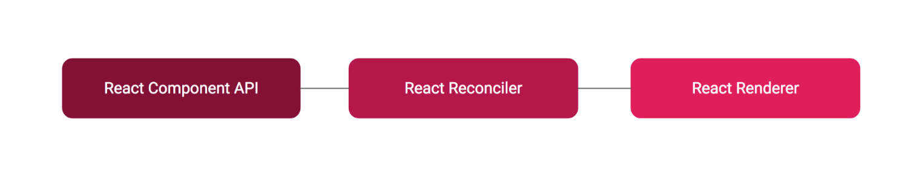
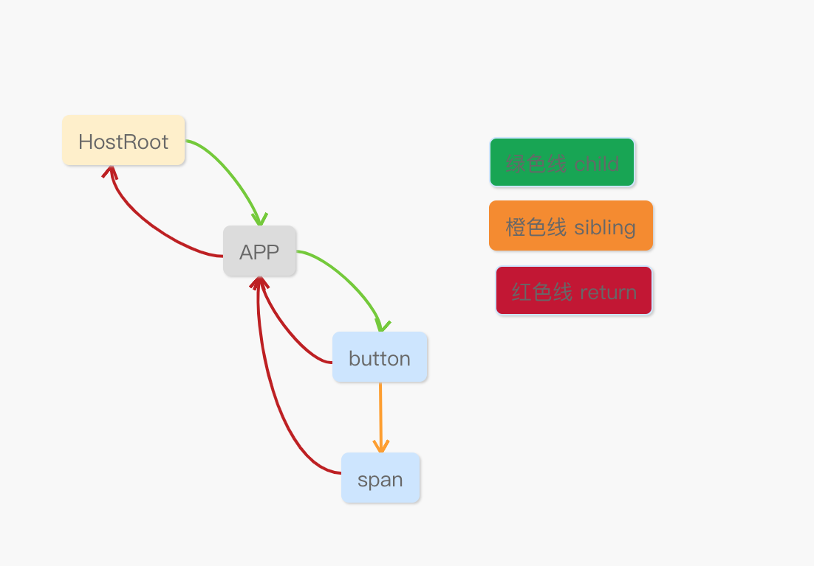
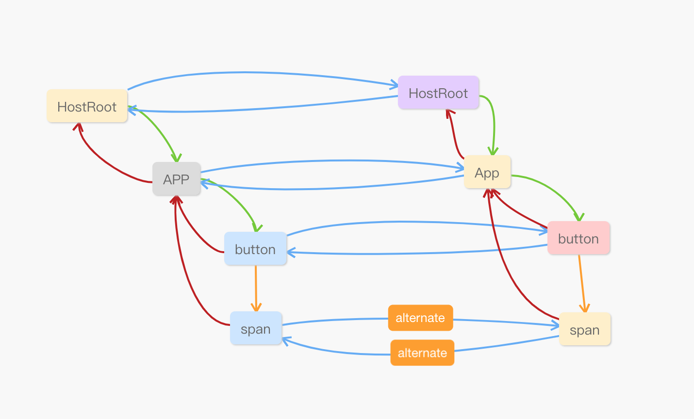
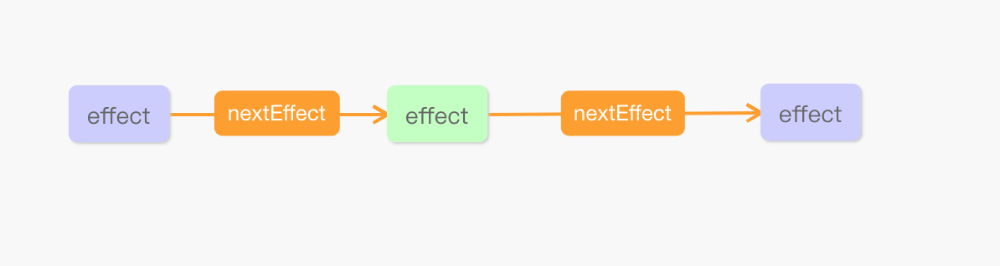

# 项目结构
## react 
react.js这个包主要包含定义React组件所需的功能,它通常与React渲染器一起使用，例如用于web的react-dom，或者用于native环境的react-native.

### React 的三个基本模块



- React Component API:提供组件的API和生命周期
- React Reconciler:React diff算法的核心，计算变化且应用变化到目标上
- React Renderer :React-reconciler所需的一些功能的实现,react-reconciler 将根据需要调用这些函数来应用更新到目标上。
>React的设计使得Reconciliation和renderer是分开的阶段,所以React可以支持不同的目标平台，如DOM,native等  Reconcilation责计算树的哪些部分改变了，renderer使用该信息对应用程序进行实际上的更新渲染。reconciler其实是不同的平台共享的。


根据React Reconciler 可以自定义renderer 


# 从JSX到React element
React 的一个核心概念是 UI 是数据的投影 ，组件的本质可以看作输入数据，输出UI的描述信息（虚拟DOM树），即:
```
UI = f(data)
```
渲染一个 React app，其实是在调用一个函数，函数本身会调用其它函数，最终渲染出UI.

JSX为创建元素提供了一种语法糖，babel会帮我们调用 React.createElement对JSX语法进行转换。
```
render(){
  return(
    <div>
    <input value="foo" type="text/>
    <span onClick="(e)=>alert("Hello)">click me</span>
    </div>
  )
}

--------调用createElemet方法--------
 createElement(
    "div",
    {id:"container"},
    createElement(
        "input",
        {value:"foo",type:"text"}
        ),
    createElement(
        "span",
        {onClick:e=> alert("Hello React")},
        children:"click me"
    ) 
)


--------creteElement内部调用ReactElement方法

{
    type:"div",
    props:{
        id:"container",
        children:[
            {
                type:"input",
                props:{value:"foo",type:"text"}
            },
            {
                type:"span"
                props:{
                    onClick:e=> alert("Hello React"),
                    children:"click me"
                }
            }
        ]
    }
}


```
## createElement
处理props
```
function createElement(type, config, children) {
  return ReactElement(type,key, ref, self, source, ReactCurrentOwner.current, props)
}
```
创建React element的工厂方法
```
export type Source = {
  fileName: string,
  lineNumber: number,
};


function ReactElement () {
  var ReactElement = function (type, key, ref, self, source, owner, props) {
  var element = {
    // 标记这是个 React Element
    $$typeof: REACT_ELEMENT_TYPE,

    // element的type
    type: type,
    key: key,
    ref: ref,
    props: props,

    // 创建当前元素的组件.
    _owner: owner
  };
  return element
  }
```


#  React Reconciliation
React团队重写了React 的核心算法---Reconciliation,一般将之前的算法叫Stack Reconciliation，现在的叫Fiber Reconciliation。


## Fiber Reconciliation

Fiber Reconciliation 特点：
- 增量渲染：能够将渲染工作分割成块并将其分散到多个帧中
- 暂停工作，去完成优先级更高的工作，之后可以返回重新开始
- 可以为不同类型的工作设置优先级
- 复用之前已经完成的工作
- 中止已经不再需要的工作


> 计算机通常跟踪程序执行的方式是使用调用堆栈，当一个函数执行的时候，新的stack frame被添加到stack中，当处理UI时，如果一次性处理太多的工作，容易导致丢帧，之前的stack reconciliation 的调用栈我们本身无法控制， 只能一次执行完成。


Fiber 就是为了解决这个痛点，可以去按需要打断调用栈，手动控制 stack frame——就这点来说，Fiber 可以理解为 virtual stack frame，将堆栈帧保留在内存中，然后无论何时都执行它们。


## Fiber的结构
普通的js对象 ,它包含有关组件的输入和输出的信息。
下面是fiber一些重要的属性。


key | type |desc
---|---|---
tag | Number | FiberNode的类型,如HostRoot,HostComponent，HostText等有18种
key | string | key属性
type | (FunctionString,Symbol,Number,Object)|和ReactElement一致
stateNode | （FiberRoot，DomElement，ReactComponentInstance）|FiberNode会通过stateNode绑定一些其他的对象，例如FiberNode对应的Dom、FiberRoot、ReactComponent实例
return |	FiberNode或null	| 表示父级 FiberNode
child | FiberNode或null	 |表示第一个子 FiberNod
sibling |	FiberNode或null	| 表示紧紧相邻的下一个兄弟 FiberNode
alternate | FiberNode或null	 |Fiber调度算法采取了双缓冲池算法，current的alternate指向workInProgerss ,而workInProgress的alternate指向current，在创建workInProgerss的时候会尽量重用current.alternate
pendingProps |	Object	|表示新的props,来自element的props
memoizedProps | Object |	表示上一次render时的props
memoizedState |	Object |	表示处理后的新state
updateQueue | UpdateQueue | 更新队列，队列内放着即将要发生的变更状态
effectTag | Number | 16进制的数字，可以理解为通过一个字段标识n个动作，如Placement、Update、Deletion、Callback……所以源码中看到很多 &=
firstEffect | FiberNode，null|与副作用操作遍历流程相关 当前节点下，第一个需要处理的副作用FiberNode的引用
nextEffect | FiberNode，null|表示下一个将要处理的副作用FiberNode的引用
lastEffect | FiberNode，null|表示最后一个将要处理的副作用FiberNode的引用。
pendingWorkPriority | number | 工作的优先级，数字越大，优先级越低


## Fiber的拆分

既然要将任务拆分为小任务，得有拆分的方案。
Fiber的拆分方案就是按照虚拟DOM拆分，因为fiber tree是根据Virtual DOM tree 构建出来的，结构上是一样的，只是节点携带的信息不一样。

因此，每个组件实例和每个DOM节点的抽象表示都是一个工作单元，在工作循环中，每次处理一个fiber,处理完一个就会判断是否有高优先级的任务或者剩余时间是否充足，可以继续处理或者挂起或者完成工作循环。


## From React Elements to Fiber nodes

```
class App extends React.Component {
    constructor(props) {
        super(props);
        this.state = {count: 0};
        this.handleClick = this.handleClick.bind(this);
    }

    handleClick() {
        this.setState((state) => {
            return {count: state.count + 1};
        });
    }


    render() {
        return <React.Fragment>
            <button key="1" onClick={this.handleClick}>点我</button>
            <span key="2">{this.state.count}</span>
            </React.Fragment>
    }
}
```

## Fiber 工作流程
主要有两个阶段
1. reconciliation/render  可暂停，恢复等。
2. commit 一次性完成
### reconciliation/render
render的重点是确定需要插入，更新或删除哪些节点，以及哪些组件需要调用其生命周期方法。

在reconciliation 时，自顶向下逐节点构造workInProgress tree。
会根据render生成的react elements生成对应的fiber nodes tree, 每一个element 对应一个fiber node，fiber持有组件的状态和DOM，用于描述需要完成的工作。react element在每次render的时候都会新建，但是fiber并不会，如果current.alertnate存在则会重用之前的fiber，仅仅把相应的react element的属性更新到这个fiber上。

创建fiber时根据不同type会调用不同的方法进行的处理，但是最后都会调用creteFiber方法来创建fiber
```
createHostRootFiber
createFiberFromElement
createFiberFromFragment
createFiberFromPortal
createFiberFromText
...

fiber = createFiber(fiberTag, pendingProps, key, mode)
```



这是一个链表结构的fiber tree.

#### Current and workInProgress

在第一次render之后，React生成了一个fiber tree代表着当前应用的状态，这棵树就是current，当开始更新的时候，会创建一个workInProgress tree，代表未来会应用到屏幕上的状态。

所有的工作都在workInProgress tree上进行，React遍历current tree,对每一个存在的fiber node 会创建一个workInProgress tree，其数据来自render方法返回的react element。一旦所有的工作完成了且workInProgress tree被render到屏幕上，workInProgress tree就是current tree了。

## workInProgress 双缓冲池技术

```
 workInProgress.alternate = current;
current.alternate = workInProgress;
```

他和当前的fiber通过alternate进行关联，在构建workInProgress 时，会取current.alternate，存在则复用，不存在则创建。这样做能够复用内部对象（fiber），节省内存分配、GC的时间开销。




#### Fiber Reconciliation流程分析

1. 如果当前节点不需要更新，则把子节点clone过来，跳到步骤5
2. 跟新当前节点的props,state,context等，调用getDerivedStateFromProps静态方法
3. 调用shouldComponentUpdate()，false的话，跳到步骤5
4. 调用组件的render方法获得新的children, 进行reconcileChildren，为子节点创建fiber（创建过程会尽量复用现有fiber，子节点增删移动发生在这里，不是真实的dom节点，并标记effectTag，收集effect）
5. 如果没有workInProgress.child，则工作单元结束，调用completeWork，如果是dom节点就diffProperties,标记tag，把effect list归并到return fiber，并把当前节点的sibling作为下一个工作单元；否则把child作为下一个工作单元
6. 如果没有剩余可用时间了，等到下一次主线程空闲时才开始下一个工作单元；否则，立即开始做
7. 当返回到root节点的时候，工作循环结束，进入commit阶段
8. commit阶段，标记isWorking = true;此阶段不可打断。有三个大循环遍历effect list。


#### 工作循环和主要方法介绍
```
function workLoop(isYieldy) {
    if (!isYieldy) {
        // Flush work without yielding
        while (nextUnitOfWork !== null) {
            nextUnitOfWork = performUnitOfWork(nextUnitOfWork);
        }
    } else {
        // Flush asynchronous work until the deadline runs out of time.
        while (nextUnitOfWork !== null && !shouldYield()) {
            nextUnitOfWork = performUnitOfWork(nextUnitOfWork);
        }
    }
}
function performUnitOfWork(workInProgress){
  var current$$1 = workInProgress.alternate;
  var next = void 0;
  //始终返回指向要在循环中处理的下一个子节点的指针或null。
  next = beginWork(current$$1, workInProgress, nextRenderExpirationTime);
  if (next === null) {
    // If this doesn't spawn new work, complete the current work.
    next = completeUnitOfWork(workInProgress);
  }
  return next;
} 

function completeUnitOfWork(workInProgress) {
    while (true) {
        let returnFiber = workInProgress.return;
        let siblingFiber = workInProgress.sibling;

        nextUnitOfWork = completeWork(workInProgress);

        if (siblingFiber !== null) {
            // If there is a sibling, return it
            // to perform work for this sibling
            return siblingFiber;
        } else if (returnFiber !== null) {
            // If there's no more work in this returnFiber,
            // continue the loop to complete the parent.
            workInProgress = returnFiber;
            continue;
        } else {
            // We've reached the root.
            return null;
        }
    }
}


```

nextUnitOfWork 指向workInProgress的fiber node,随着遍历的进行，使用该变量能判断是否有未完成的工作，在current fiber处理完之后，nextUnitOfWork指向下一个fiber node或null,当返回null时，会退出workLoop,准备进入commit 阶段。

#### Side-effects

state和props的改变会产生 side-effects，每个fiber node都有与之关联的effect,用effectTag 进行标识，其表示在处理更新时需要在实例上完成的工作，对于host components来说，可以有增加，删除，更新。对于class component来说，要更新其refs,调用componentDidMount，componentDidUpdate等生命周期。

React 使用单链表存储effect, 通过nextEffect指向下一个effect




### Commit阶段

这是React更新DOM并调用生命周期的地方。

这个阶段，有两颗树和effects list,current代表当前屏幕上呈现的状态,workInProgress或者finishedWork代表需要刷新到屏幕上的状态，effects list存储effect的链表，这个render阶段的输出结果。


这个阶段的主要工作如下

1. 调用getSnapshotBeforeUpdate生命周期钩子
2. 在effectTag=Deletion的节点上调用componentWillUnmount生命周期方法
3. 在使用Deletion效果标记的节点上
4. 设置 finishedWork tree 为 current
5. 调用 componentDidMount生命周期 如果该节点标记为 Placement
6. 调用 componentDidUpdate生命周期 如果该节点标记为 Update

```
function commitRoot(root, finishedWork) {
    commitBeforeMutationLifecycles()
    commitAllHostEffects();
    root.current = finishedWork;
    commitAllLifeCycles();
}
```
这个commit 阶段核心是三个大循环，遍历effects list
**第一个循环** commitBeforeMutationLifecycles 调用组件的getSnapshotBeforeUpdate 
```
function commitBeforeMutationLifecycles() {
  while (nextEffect !== null) {

    var effectTag = nextEffect.effectTag;
    if (effectTag & Snapshot) {
      recordEffect();
      var current$$1 = nextEffect.alternate;
      commitBeforeMutationLifeCycles(current$$1, nextEffect);
    }

    nextEffect = nextEffect.nextEffect;
  }
}
```
**第二个循环** commitAllHostEffects ，根据effectTag应用更新，有三种tag,(Placement | Update | Deletion)
```
function commitAllHostEffects() {
  while (nextEffect !== null) {

    var effectTag = nextEffect.effectTag;

    if (effectTag & ContentReset) {
      commitResetTextContent(nextEffect);
    }

    if (effectTag & Ref) {
      var current$$1 = nextEffect.alternate;
      if (current$$1 !== null) {
        commitDetachRef(current$$1);
      }
    }

    var primaryEffectTag = effectTag & (Placement | Update | Deletion);
    switch (primaryEffectTag) {
      case Placement:
        {
          commitPlacement(nextEffect);
          nextEffect.effectTag &= ~Placement;
          break;
        }
      case PlacementAndUpdate:
        {
          // Placement
          commitPlacement(nextEffect);
          nextEffect.effectTag &= ~Placement;

          // Update
          var _current = nextEffect.alternate;
          commitWork(_current, nextEffect);
          break;
        }
      case Update:
        {
          var _current2 = nextEffect.alternate;
          commitWork(_current2, nextEffect);
          break;
        }
      case Deletion:
        {
          commitDeletion(nextEffect);
          break;
        }
    }
    nextEffect = nextEffect.nextEffect;
  }

}
```


**第三个循环**  commitAllLifeCycles 调用生命周期，初次挂载调用componentDidMount，更新阶段调用componentDidUpdate 


```
function commitAllLifeCycles(finishedRoot, committedExpirationTime) {
  while (nextEffect !== null) {
    var effectTag = nextEffect.effectTag;

    if (effectTag & (Update | Callback)) {
      var current$$1 = nextEffect.alternate;
      commitLifeCycles(finishedRoot, current$$1, nextEffect, committedExpirationTime);
    }

    if (effectTag & Ref) {
      commitAttachRef(nextEffect);
    }

    if (effectTag & Passive) {
      rootWithPendingPassiveEffects = finishedRoot;
    }

    nextEffect = nextEffect.nextEffect;
  }
}
```


## ChildReconciler 


该算法基于两大假设

- Two elements of different types will produce different trees.
- The developer can hint at which child elements may be stable across different renders with a key prop.

```
function reconcileChildFibers(returnFiber, currentFirstChild, newChild, expirationTime) {
    
    var isUnkeyedTopLevelFragment = typeof newChild === 'object' && newChild !== null && newChild.type === REACT_FRAGMENT_TYPE && newChild.key === null;
    if (isUnkeyedTopLevelFragment) {
        newChild = newChild.props.children;
    }

    // 新的child是否为非空对象
    var isObject = typeof newChild === 'object' && newChild !== null;
    // 是对象
    if (isObject) {
        switch (newChild.$$typeof) {
            // 一般的div,span等浏览器标签组件
          case REACT_ELEMENT_TYPE:
            return placeSingleChild(reconcileSingleElement(returnFiber, currentFirstChild, newChild, expirationTime));
          // portal 组件
          case REACT_PORTAL_TYPE:
            return placeSingleChild(reconcileSinglePortal(returnFiber, currentFirstChild, newChild, expirationTime));
        }
    }
    // 如果是字符串或者数字，这里指的是纯文本
    if (typeof newChild === 'string' || typeof newChild === 'number') {
        return placeSingleChild(reconcileSingleTextNode(returnFiber, currentFirstChild, '' + newChild, expirationTime));
    }
    // newChild 是数组 ，一个元素包含多个子元素，那么子元素就是数组形式
    if (isArray(newChild)) {
        return reconcileChildrenArray(returnFiber, currentFirstChild, newChild, expirationTime);
    }
    // newChild是可以迭代的
    if (getIteratorFn(newChild)) {
        return reconcileChildrenIterator(returnFiber, currentFirstChild, newChild, expirationTime);
    }
    // 下面部分抛错处理，
    if (isObject) {
        throwOnInvalidObjectType(returnFiber, newChild);
    }

    {
        if (typeof newChild === 'function') {
            warnOnFunctionType();
        }
    }
    if (typeof newChild === 'undefined' && !isUnkeyedTopLevelFragment) {
        // If the new child is undefined, and the return fiber is a composite
        // component, throw an error. If Fiber return types are disabled,
        // we already threw above.
        switch (returnFiber.tag) {
            case ClassComponent:
                {
                    {
                        var instance = returnFiber.stateNode;
                        if (instance.render._isMockFunction) {
                            // We allow auto-mocks to proceed as if they're returning null.
                            break;
                        }
                    }
                }
            // Intentionally fall through to the next case, which handles both
            // functions and classes
            // eslint-disable-next-lined no-fallthrough
            case FunctionComponent:
                {
                    var Component = returnFiber.type;
                    invariant(false, '%s(...): Nothing was returned from render. This usually means a return statement is missing. Or, to render nothing, return null.', Component.displayName || Component.name || 'Component');
                }
        }
    }

    // 剩下的都当作空处理，delete 掉 
    return deleteRemainingChildren(returnFiber, currentFirstChild);
}
```

可以看出reconcileSingleElement 是处理的核心方法，reconcileChildFibers只是分类处理newChild

returnFiber 是父级fiber currentFirstChild 是current fiber的child。


```
function reconcileSingleElement(returnFiber, currentFirstChild, element, expirationTime) {
    var key = element.key;
    var child = currentFirstChild;
    // current.child 存在 说明之前创建过，此次是更新，否则直接创建fiber
    while (child !== null) {
        // TODO: If key === null and child.key === null, then this only applies to
        // the first item in the list.
        // newChild 的 key 是否和 currrent 的 child.key 相同？
        if (child.key === key) {
            // key 相同，还要比较type
            if (child.tag === Fragment ? element.type === REACT_FRAGMENT_TYPE : child.elementType === element.type) {
                // 因为diff的是单个的Element,所以要删除兄弟节点
                deleteRemainingChildren(returnFiber, child.sibling);
                // 基于child复制一个fiber，用传入的props,修改其pendingProps
                var existing = useFiber(child, element.type === REACT_FRAGMENT_TYPE ? element.props.children : element.props, expirationTime);
                existing.ref = coerceRef(returnFiber, child, element);
                existing.return = returnFiber;
                {
                    existing._debugSource = element._source;
                    existing._debugOwner = element._owner;
                }
                return existing;
            } else {
                // type不同，删除该child及其兄弟节点
                deleteRemainingChildren(returnFiber, child);
                break;
            }
        } else {
            // key 不同，删除该child
            deleteChild(returnFiber, child);
        }
        child = child.sibling;
    }
    // 直接创建fiber 并返回
    if (element.type === REACT_FRAGMENT_TYPE) {
        var created = createFiberFromFragment(element.props.children, returnFiber.mode, expirationTime, element.key);
        created.return = returnFiber;
        return created;
    } else {
        var _created4 = createFiberFromElement(element, returnFiber.mode, expirationTime);
        _created4.ref = coerceRef(returnFiber, currentFirstChild, element);
        _created4.return = returnFiber;
        return _created4;
    }
}
对比新旧元素的key和type，相同则认为是同一个元素发生更新，这个时候会直接创建和之前一样的 fiber，只是会传入新的 props，给到生成的 fiber。 在创建新的fiber的时候会判断current.alternate是否存在，存在就复用，修改其pendingProps等属性。
```

#### diff 属性

diffProperties 就是对比新老 DOM 的不同

在completeWork过程中，会diff属性，生成updatePayload,这是一个数组，奇数项是key，偶数为新的值。 最后再将其赋予给到 workInProgress.updateQueue，更重要的是修改 effectTag，在 commit 阶段被识别到这是一个更新。 同时修改return fiber 的firstEffect/lastEffect， 子 fiber 的 effects 会通过链表的形式被添加到父 fiber 的 effects 上面。如果有原先的存在的则通过 fiber 的 nextEffct 来传递，实现链表。
workInProgress.updateQueue = updatePayload;

#### 更新DOM属性

在commit 的第二个大循环中，会提交所有的effect。其中涉及到更新如下

```
function updateDOMProperties(domElement, updatePayload, wasCustomComponentTag, isCustomComponentTag) {
  // TODO: Handle wasCustomComponentTag
  for (var i = 0; i < updatePayload.length; i += 2) {
    var propKey = updatePayload[i];
    var propValue = updatePayload[i + 1];
    if (propKey === STYLE$1) {
      setValueForStyles(domElement, propValue);
    } else if (propKey === DANGEROUSLY_SET_INNER_HTML) {
      setInnerHTML(domElement, propValue);
    } else if (propKey === CHILDREN) {
      setTextContent(domElement, propValue);
    } else {
      setValueForProperty(domElement, propKey, propValue, isCustomComponentTag);
    }
  }
}
```
## setState机制

```
state={
    count:0
}
setCount = () => {
    this.setState({
      count: this.state.count + 1
    });
    this.setState({
      count: this.state.count + 1
    });
    this.setState({
      count: this.state.count + 2
    });
  };
  
  onClick = ()=>{
     this.setCount() 
  }
  onCLickAsync=()=>{
      Promise.resolve(1)
      .then(()=>{
         this.setCount()  
      })
  }
```
#### 场景一

事件回调中直接setState


当事件触发的时候会遇到两个方法，第一个会首先调用，将isBatchingUpdates置为true，然后触发第一个setState,将第一个update对象添加到fiber的更新队列中，开始scheduleWork,申请开始工作requestWork的时候，由于isBatchingUpdates还是true，就会return，会接着调用第二个setState,重复前面的过程，知道事件回调执行完毕。这就是批处理。

> 需要注意的是这里使用的this.state.count初始为0，由于进入了批处理，this.state.count并没有发生变化，所有每次的setState中的this.state.count为0，在计算最终state时采用Object.assign合并state,所以最终的state以最后一次为准。真个过程触发一次render


```

function batchedUpdates$1(fn, a) {
  
  var previousIsBatchingUpdates = isBatchingUpdates;
  isBatchingUpdates = true;
  try {
    return fn(a);
    
  } finally {
    isBatchingUpdates = previousIsBatchingUpdates;
    if (!isBatchingUpdates && !isRendering) {
      performSyncWork();
    }
  }
}

enqueueSetState: function (inst, payload, callback) {
    var fiber = get(inst);
    var currentTime = requestCurrentTime();
    var expirationTime = computeExpirationForFiber(currentTime, fiber);

    var update = createUpdate(expirationTime);
    update.payload = payload;
    if (callback !== undefined && callback !== null) {
      {
        warnOnInvalidCallback$1(callback, 'setState');
      }
      update.callback = callback;
    }

    flushPassiveEffects();
    enqueueUpdate(fiber, update);
    scheduleWork(fiber, expirationTime);
  }
  
function requestWork(root, expirationTime) {
  addRootToSchedule(root, expirationTime);
  if (isRendering) {
    // Prevent reentrancy. Remaining work will be scheduled at the end of
    // the currently rendering batch.
    return;
  }

  if (isBatchingUpdates) {
    // Flush work at the end of the batch.
    if (isUnbatchingUpdates) {
      // ...unless we're inside unbatchedUpdates, in which case we should
      // flush it now.
      nextFlushedRoot = root;
      nextFlushedExpirationTime = Sync;
      performWorkOnRoot(root, Sync, true);
    }
    return;
  }

  // TODO: Get rid of Sync and use current time?
  if (expirationTime === Sync) {
    performSyncWork();
  } else {
    scheduleCallbackWithExpirationTime(root, expirationTime);
  }
}
```
#### 场景二 
在setTimeout或者异步函数的回调中调用


这种情况不会批处理，会按照次序调用三次setStae，每一次整个流程走完之后，调用下一个。由于是异步调用，根据事件循环原理，调用栈为空才会执行任务队列的任务，而此时isBatchingUpdates已经为false. isRendering也是false

#### 场景三
在生命周期中调用
如componentDidMount componentDidUpdate。
此时isRendering为true 会进行批处理
## setState的函数参数


```
state={count:0}
setCount = ()=>{
      this.setState(prevState=>{
        return { count: prevState.count + 1 };
      });
      this.setState(prevState => {
        return { count: prevState.count + 1 };
      });
      this.setState(prevState => {
        return { count: prevState.count + 1 };
      });
  }
```
在批处理环节，上面的setCount方法计算的最终结果是3.

其中涉及原因如下


```
//遍历update链表
 var newBaseState = queue.baseState;
  var newFirstUpdate = null;
  var newExpirationTime = NoWork;

  // Iterate through the list of updates to compute the result.
  var update = queue.firstUpdate;
  var resultState = newBaseState;
 while (update !== null) {

   resultState = getStateFromUpdate(workInProgress, queue, update, resultState, props, instance);

   update = update.next;
 }
 
 
 
 //getStateFromUpdate 部分代码
 function getStateFromUpdate(workInProgress, queue, update, prevState, nextProps, instance) {
 //省略
 case UpdateState:
      {
        var _payload2 = update.payload;
        var partialState = void 0;
        if (typeof _payload2 === 'function') {
          // Updater function
          {
            if (debugRenderPhaseSideEffects || debugRenderPhaseSideEffectsForStrictMode && workInProgress.mode & StrictMode) {
              _payload2.call(instance, prevState, nextProps);
            }
          }
          partialState = _payload2.call(instance, prevState, nextProps);
        } else {
          // Partial state object
          partialState = _payload2;
        }
        if (partialState === null || partialState === undefined) {
          // Null and undefined are treated as no-ops.
          return prevState;
        }
        // Merge the partial state and the previous state.
        return _assign({}, prevState, partialState);
      }
     }
```

在处理更新队列的时候，会遍历update链表，用一个临时变量resultState存储每次计算的结果，将resultState作为prevState参数。

```
partialState = _payload2.call(instance, prevState, nextProps);
```
_payload2 就是setState的第一个参数，我们传入的方法。
由于prevState 是上一次计算的结果，下一次调用就是在上一次结果上进行计算。所以最终结果是3.

